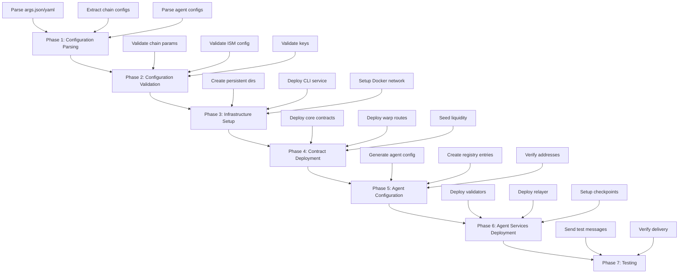

# Hyperlane Kurtosis Package

A comprehensive Kurtosis package for deploying and managing Hyperlane cross-chain infrastructure. This package orchestrates the complete deployment of Hyperlane core contracts, warp routes, validators, relayers, and associated services across multiple EVM chains.

## 🏗️ Package Overview

### Key Features
- **Multi-chain deployment** via external RPCs (N≥2 chains)
- **Complete Hyperlane stack** deployment including core contracts, warp routes, and agents  
- **Flexible ISM configuration** supporting multisig, trusted relayer, aggregation, and routing ISMs
- **Dockerized infrastructure** with pre-built containers for consistent deployments
- **Testing utilities** for cross-chain message verification and monitoring
- **Security-first design** with no public RPC fallbacks and configurable checkpoint syncers
- **Modular architecture** enabling easy customization and extension

### Supported Topologies
- **lock_release**: Native-to-native token transfers (e.g., ETH ↔ ETH)
- **lock_mint**: Lock canonical tokens, mint synthetic representations
- **burn_mint**: Burn on source, mint on destination for bridged assets

## 🎯 Quick Start

```bash
# Clean environment and run with example configuration
kurtosis clean -a
kurtosis run --enclave hyperlane . --args-file config-examples/multisig-config.json

# Monitor deployment
kurtosis service logs hyperlane hyperlane-cli
kurtosis service logs hyperlane relayer
kurtosis service logs hyperlane validator-ethereum
```

## 📋 Table of Contents

- [Architecture Overview](#-architecture-overview)
- [Directory Structure](#-directory-structure)
- [Inner Workings](#-inner-workings)
- [Configuration System](#-configuration-system)
- [Checkpoint Storage](#-checkpoint-storage)
- [Deployment Flow](#-deployment-flow)
- [Component Details](#-component-details)
- [Usage Guide](#-usage-guide)
- [ISM Configuration](#-ism-configuration)
- [Testing & Verification](#-testing--verification)
- [Development Guide](#-development-guide)
- [Troubleshooting](#-troubleshooting)

## 🏛️ Architecture Overview

The Hyperlane Kurtosis Package follows a modular, layered architecture designed for scalability and maintainability:

```
┌─────────────────────────────────────────────────────────────┐
│                    Kurtosis Orchestration Layer             │
├─────────────────────────────────────────────────────────────┤
│  Configuration  │  Infrastructure  │   Services   │ Testing │
│     Modules     │     Modules      │   Modules    │ Modules │
├─────────────────┼──────────────────┼──────────────┼─────────┤
│  • Parser       │  • CLI Service   │  • Validators│ • Send  │
│  • Validator    │  • Agent Config  │  • Relayer   │   Test  │
│  • Constants    │                  │              │         │
├─────────────────┼──────────────────┼──────────────┼─────────┤
│             Contract Deployment Modules                     │
│              • Core Contracts • Warp Routes                 │
├─────────────────────────────────────────────────────────────┤
│                    Docker Infrastructure                    │
│  • Hyperlane CLI Container  • Agent Services Container     │
├─────────────────────────────────────────────────────────────┤
│                    External Dependencies                    │
│     • Chain RPCs  • Private Keys  • Docker Registry        │
└─────────────────────────────────────────────────────────────┘
```

### Core Components

1. **Main Orchestrator** (`main.star`): Entry point that coordinates all deployment phases
2. **Configuration System**: Parses, validates, and manages all deployment parameters
3. **Infrastructure Layer**: Manages Docker containers and service deployment
4. **Contract Deployment**: Handles core contracts and warp route deployments
5. **Agent Services**: Manages validators and relayers
6. **Testing Framework**: Provides cross-chain message testing capabilities

## 📁 Directory Structure

```
hyperlane-package/
├── main.star                      # Main orchestration entry point
├── kurtosis.yml                   # Kurtosis package metadata
├── README.md                      # This documentation
├── LICENSE                        # MIT License
│
├── config-examples/               # Pre-configured deployment templates
│   ├── README.md                  # Configuration documentation  
│   ├── multisig-config.json       # Basic multisig ISM setup
│   ├── existing-contracts-config.json  # Using pre-deployed contracts
│   ├── custom-chains-config.json  # Custom chain configurations
│   ├── ism-types-config.json      # Different ISM type examples
│   ├── routing-ism-config.json    # Per-domain routing ISM
│   └── aggregation-ism-config.json # Multiple ISM aggregation
│
├── modules/                       # Starlark modules for deployment logic
│   ├── config/                    # Configuration management
│   │   ├── constants.star         # Global constants and defaults
│   │   ├── parser.star            # Configuration parsing logic
│   │   ├── validator.star         # Configuration validation
│   │   └── ism_config.star        # ISM-specific configuration
│   │
│   ├── contracts/                 # Contract deployment modules
│   │   ├── core.star              # Core Hyperlane contract deployment
│   │   └── warp.star              # Warp route deployment logic
│   │
│   ├── infrastructure/            # Infrastructure management
│   │   ├── cli.star               # Hyperlane CLI service management
│   │   └── agents.star            # Agent configuration generation
│   │
│   ├── services/                  # Service deployment modules
│   │   ├── validator.star         # Validator service orchestration
│   │   └── relayer.star           # Relayer service management
│   │
│   ├── testing/                   # Testing and verification
│   │   └── send_test.star         # Cross-chain message testing
│   │
│   └── utils/                     # Utility functions and helpers
│       ├── helpers.star           # Common utility functions
│       └── build.sh               # Docker image build script
│
├── src/                           # Source code and Docker configurations
│   └── deployments/
│       └── hyperlane-deployer/    # Hyperlane CLI Docker container
│           ├── Dockerfile         # CLI container configuration
│           ├── common.sh          # Shared shell utilities
│           │
│           ├── deployment-scripts/ # Core deployment automation
│           │   ├── deploy_core.sh # Core contract deployment
│           │   ├── warp_routes.sh # Warp route deployment
│           │   └── seed_liquidity.sh # Liquidity seeding
│           │
│           ├── config-tools/      # Configuration generation
│           │   └── agent-config-generator.js # Agent config generator
│           │
│           └── utilities/         # Deployment utilities
│               ├── send_warp.sh   # Warp route testing
│               ├── balances.js    # Balance checking
│               └── parse_txhash.js # Transaction parsing
│
├── testing-utilities/             # Advanced testing and monitoring tools
│   ├── message-sending/           # Message sending utilities
│   │   ├── send-message.js        # Basic message sending
│   │   ├── send-via-mailbox.js    # Direct mailbox interaction
│   │   └── send-test-message.js   # Test message utilities
│   │
│   ├── verification/              # Message verification tools
│   │   ├── verify-delivery.js     # Delivery verification
│   │   ├── prove-delivery.js      # Delivery proof generation
│   │   └── exhaustive-tx-search.js # Transaction search
│   │
│   ├── monitoring/                # Network monitoring
│   │   ├── continuous-monitor.js  # Continuous monitoring
│   │   ├── network-health.js      # Network health checks
│   │   └── balance-monitor.js     # Balance monitoring
│   │
│   └── advanced/                  # Advanced testing scenarios
│       ├── stress-test.js         # Network stress testing  
│       ├── multi-hop-test.js      # Multi-hop message testing
│       └── performance-benchmark.js # Performance benchmarking
│
├── docs/                          # Additional documentation
│   ├── ISM_CONFIGURATION.md       # ISM configuration guide
│   ├── TROUBLESHOOTING.md         # Troubleshooting guide
│   └── API_REFERENCE.md           # API reference documentation
│
└── templates/                     # Configuration templates
    ├── core-config.json           # Core deployment template
    └── ism/                       # ISM configuration templates
        ├── multisig.json          # Multisig ISM template
        ├── trusted-relayer.json   # Trusted relayer template
        └── aggregation.json       # Aggregation ISM template
```

## ⚙️ Inner Workings

### Deployment Flow

The package executes deployments through seven distinct phases:



### Key Processing Steps

#### Phase 1: Configuration Parsing (`modules/config/parser.star`)
- Parses JSON/YAML configuration files
- Extracts chain configurations, agent settings, ISM parameters
- Normalizes chain names and validates basic structure
- Prepares configuration objects for validation

#### Phase 2: Configuration Validation (`modules/config/validator.star`)  
- Validates chain parameters (RPC URLs, chain IDs, addresses)
- Verifies agent key formats and permissions
- Validates ISM configurations and threshold requirements
- Ensures deployment consistency across chains

#### Phase 3: Infrastructure Setup (`modules/infrastructure/cli.star`)
- Creates persistent directories for configuration and registry
- Deploys Hyperlane CLI Docker container with environment variables
- Sets up networking and shared storage volumes
- Prepares deployment environment

#### Phase 4: Contract Deployment (`modules/contracts/`)
- **Core Deployment** (`core.star`): Deploys mailbox, ISM, and core infrastructure
- **Warp Routes** (`warp.star`): Deploys token bridge contracts
- **Liquidity Seeding**: Provides initial liquidity for lock_release routes
- **Address Registry**: Captures and stores deployed contract addresses

#### Phase 5: Agent Configuration (`modules/infrastructure/agents.star`)
- Generates comprehensive agent configuration from deployed addresses
- Creates chain metadata and RPC mappings
- Configures ISM settings and validator requirements  
- Validates configuration completeness

#### Phase 6: Agent Services (`modules/services/`)
- **Validators** (`validator.star`): Deploys per-chain validator services
- **Relayer** (`relayer.star`): Deploys multi-chain relayer service
- **Checkpoint Sync**: Configures local or remote checkpoint storage
- **Health Monitoring**: Sets up service health checks

#### Phase 7: Testing (`modules/testing/send_test.star`)
- Executes cross-chain message tests if configured
- Verifies message delivery and processing
- Reports deployment status and contract addresses

## 🔧 Configuration System

### Configuration Schema

The package accepts JSON or YAML configuration with the following structure:

```json
{
  "chains": [
    {
      "name": "ethereum",
      "rpc_url": "https://your-ethereum-rpc",
      "chain_id": 1,
      "deploy_core": true,
      "existing_addresses": {
        "mailbox": "0x...",
        "igp": "0x...",
        "validatorAnnounce": "0x...",
        "ism": "0x..."
      }
    }
  ],
  "agents": {
    "deployer": {
      "key": "0xYOUR_PRIVATE_KEY"
    },
    "relayer": {
      "key": "0xYOUR_PRIVATE_KEY", 
      "allow_local_checkpoint_syncers": true
    },
    "validators": [
      {
        "chain": "ethereum",
        "signing_key": "0xYOUR_PRIVATE_KEY",
        "checkpoint_syncer": {
          "type": "local",
          "params": {
            "path": "/validator-checkpoints"
          }
        }
      }
    ]
  },
  "warp_routes": [
    {
      "symbol": "ETH",
      "decimals": 18,
      "topology": {
        "ethereum": "collateral",
        "arbitrum": "synthetic"
      },
      "mode": "lock_release",
      "initialLiquidity": [
        {
          "chain": "ethereum",
          "amount": "10000000000000000"
        }
      ],
      "owner": "0xOWNER_ADDRESS"
    }
  ],
  "send_test": {
    "enabled": true,
    "origin": "ethereum", 
    "destination": "arbitrum",
    "amount": "1000000000000000"
  },
  "global": {
    "registry_mode": "local",
    "agent_image_tag": "agents-v1.4.0",
    "cli_version": "latest",
    "ism": {
      "type": "messageIdMultisigIsm",
      "validators": ["0xVALIDATOR_ADDRESS"],
      "threshold": 1
    }
  }
}
```

### Configuration Fields

#### Chains Configuration
- **name**: Human-readable chain identifier (normalized internally)
- **rpc_url**: JSON-RPC endpoint for blockchain interaction
- **chain_id**: Numeric chain identifier  
- **deploy_core**: Whether to deploy core contracts (vs. using existing)
- **existing_addresses**: Pre-deployed contract addresses when `deploy_core: false`

#### Agent Configuration
- **deployer.key**: Private key for contract deployment operations
- **relayer.key**: Private key for relayer operations
- **validators[].signing_key**: Per-chain validator signing keys
- **checkpoint_syncer**: Storage configuration for validator checkpoints

#### Warp Routes Configuration
- **symbol**: Token symbol for the warp route
- **topology**: Chain role mapping (`collateral` vs `synthetic`)
- **mode**: Bridge mode (`lock_release`, `lock_mint`, `burn_mint`)
- **initialLiquidity**: Liquidity amounts to seed on deployment
- **owner**: EOA address with administrative privileges

#### Global Settings
- **registry_mode**: Registry usage (`local` vs `public`)
- **agent_image_tag**: Docker image tag for agent services
- **cli_version**: Hyperlane CLI version to use
- **ism**: Default Interchain Security Module configuration

## 🗄️ Checkpoint Storage

Validators write signed checkpoints that the relayer must read before delivering messages. The package supports three storage backends:

- **localStorage** (*default*) – validators and the relayer share `/data/validator-checkpoints` via a persistent volume created in Phase 3. On Kubernetes, back the volume with an RWX storage class so every pod can mount it.
- **Amazon S3** – set `global.checkpoint_storage: "s3"` and fill `global.s3` with bucket/region (and optionally `folder`). Provide `AWS_ACCESS_KEY_ID`/`AWS_SECRET_ACCESS_KEY` so validators can write, and allow the relayer to read objects (public-read objects or an IAM policy). The package automatically appends a run timestamp to the folder to avoid collisions.
- **Google Cloud Storage** – set `global.checkpoint_storage: "gcs"` and populate `global.gcs`. Supply service-account credentials if the bucket is not publicly readable.

You can override the default per validator by defining `checkpoint_syncer` blocks. Whatever backend you choose, make sure the relayer can reach the latest checkpoint and proof; otherwise message delivery will stall with “ISM verification failed” errors.

## 🚀 Deployment Flow

### 1. Pre-deployment Setup

Before running the package, ensure you have:

```bash
# Install Kurtosis
curl -fsSL https://kurtosis.com/install | bash

# Verify Docker is running
docker --version

# Clean any existing enclaves
kurtosis clean -a
```

### 2. Configuration Preparation

Create your configuration file based on templates:

```bash
# Copy example configuration
cp config-examples/multisig-config.json my-config.json

# Edit with your specific parameters
# - Replace RPC URLs with your endpoints
# - Add your private keys (never commit these!)
# - Configure your desired ISM settings
```

### 3. Package Execution

Run the package with your configuration:

```bash
# Deploy with JSON configuration
kurtosis run --enclave hyperlane . --args-file my-config.json

# Deploy with YAML configuration  
kurtosis run --enclave hyperlane . --args-file my-config.yaml

# Monitor deployment progress
kurtosis service logs hyperlane hyperlane-cli --follow
```

### 4. Post-deployment Verification

Verify your deployment:

```bash
# Check service health
kurtosis enclave inspect hyperlane

# Verify contract addresses
kurtosis service exec hyperlane hyperlane-cli "cat /configs/registry/chains/ethereum/addresses.yaml"

# Test cross-chain messaging
kurtosis service exec hyperlane hyperlane-cli "hyperlane send message --origin ethereum --destination arbitrum --body 'Hello World!'"
```

## 🏗️ Component Details

### Hyperlane CLI Service

The CLI service (`modules/infrastructure/cli.star`) orchestrates contract deployments:

- **Container**: `fravlaca/hyperlane-cli:latest` 
- **Purpose**: Execute Hyperlane CLI commands for deployment and configuration
- **Key Scripts**:
  - `deploy_core.sh`: Deploys mailbox, IGP, validator announce contracts
  - `warp_routes.sh`: Deploys and configures token bridge contracts
  - `seed_liquidity.sh`: Seeds initial liquidity for lock_release routes

**Environment Variables**:
- `CHAIN_NAMES`: Comma-separated list of target chains
- `CHAIN_RPCS`: Key-value pairs of chain names to RPC URLs  
- `HYP_KEY`: Private key for deployment operations
- `ISM_TYPE`: ISM type configuration
- `REGISTRY_DIR`: Local registry path for deployed addresses

### Agent Configuration Generator

The agent config generator (`modules/infrastructure/agents.star`) creates runtime configuration:

- **Purpose**: Generate `agent-config.json` from deployed contract addresses
- **Input**: Chain configurations, validator settings, ISM parameters
- **Output**: Complete agent configuration for validators and relayer
- **Features**:
  - Automatic address resolution from registry
  - ISM configuration injection
  - Checkpoint syncer setup
  - Per-chain validator configuration

### Validator Services

Validators (`modules/services/validator.star`) provide message attestation:

- **Container**: `gcr.io/abacus-labs-dev/hyperlane-agent:agents-v1.4.0`
- **Purpose**: Validate and sign cross-chain messages
- **Architecture**: One validator service per chain
- **Key Features**:
  - Configurable checkpoint syncers (local, S3, GCS)
  - Automatic signing key management
  - Health monitoring and restart policies
  - Persistent checkpoint storage

### Relayer Service

The relayer (`modules/services/relayer.star`) handles message delivery:

- **Container**: `gcr.io/abacus-labs-dev/hyperlane-agent:agents-v1.4.0`
- **Purpose**: Relay messages between configured chains
- **Features**:
  - Multi-chain message monitoring
  - Automatic gas price management
  - Configurable delivery confirmations
  - Message batching and optimization

## 📖 Usage Guide

### Basic Deployment

1. **Choose a Configuration Template**:
   ```bash
   ls config-examples/
   # Pick the template that matches your use case
   ```

2. **Customize Configuration**:
   ```bash
   cp config-examples/multisig-config.json my-deployment.json
   # Edit RPC URLs, private keys, and chain parameters
   ```

3. **Deploy Infrastructure**:
   ```bash
   kurtosis run --enclave hyperlane . --args-file my-deployment.json
   ```

4. **Verify Deployment**:
   ```bash
   # Check all services are running
   kurtosis enclave inspect hyperlane
   
   # View deployed contract addresses
   kurtosis service logs hyperlane hyperlane-cli | grep "contract deployed"
   ```

### Advanced Configurations

#### Multiple Chain Deployment

```json
{
  "chains": [
    {
      "name": "ethereum",
      "rpc_url": "https://your-ethereum-rpc",
      "chain_id": 1,
      "deploy_core": true
    },
    {
      "name": "polygon",
      "rpc_url": "https://your-polygon-rpc", 
      "chain_id": 137,
      "deploy_core": true
    },
    {
      "name": "arbitrum",
      "rpc_url": "https://your-arbitrum-rpc",
      "chain_id": 42161,
      "deploy_core": true
    }
  ]
}
```

#### Using Existing Contracts

```json
{
  "chains": [
    {
      "name": "ethereum",
      "rpc_url": "https://your-ethereum-rpc",
      "chain_id": 1,
      "deploy_core": false,
      "existing_addresses": {
        "mailbox": "0x2f9DB5616fa3fAd1aB06cB2C906824B3B1A7b3F2",
        "igp": "0x56f52c0A1ddcD557285f7CBc782D3d83096CE1Cc",
        "validatorAnnounce": "0x9bDE63104EE030d9De419114dbb8C15e8b37C5C8"
      }
    }
  ]
}
```

#### Custom Warp Routes

```json
{
  "warp_routes": [
    {
      "symbol": "USDC",
      "decimals": 6,
      "topology": {
        "ethereum": "collateral",
        "polygon": "synthetic",
        "arbitrum": "synthetic"
      },
      "mode": "lock_mint",
      "token_addresses": {
        "ethereum": "0xA0b86a33E6441b8543C9E6b5C8f1Fb41Ff8B5F02"
      },
      "owner": "0xYourOwnerAddress"
    }
  ]
}
```

### Monitoring and Maintenance

#### Service Logs
```bash
# View CLI service logs
kurtosis service logs hyperlane hyperlane-cli --follow

# View relayer logs  
kurtosis service logs hyperlane relayer --follow

# View validator logs for specific chain
kurtosis service logs hyperlane validator-ethereum --follow
```

#### Health Checks
```bash
# Check enclave status
kurtosis enclave inspect hyperlane

# Verify agent configuration
kurtosis service exec hyperlane hyperlane-cli "cat /configs/agent-config.json"

# Check deployed addresses
kurtosis service exec hyperlane hyperlane-cli "find /configs/registry -name 'addresses.yaml' -exec cat {} \;"
```

#### Message Testing
```bash
# Send a test message
kurtosis service exec hyperlane hyperlane-cli \
  "hyperlane send message \
   --origin ethereum \
   --destination arbitrum \
   --body 'Test message' \
   --registry /configs/registry"

# Check message delivery
kurtosis service logs hyperlane relayer | grep -i "delivered"
```

## 🔐 ISM Configuration

### Supported ISM Types

The package supports comprehensive ISM (Interchain Security Module) configuration:

#### 1. Multisig ISM
```json
{
  "global": {
    "ism": {
      "type": "messageIdMultisigIsm",
      "validators": [
        "0x9bDE63104EE030d9De419114dbb8C15e8b37C5C8",
        "0x6f85Ef80c1B5Aed7d5b7D8fB7fF1e90Ac3a8eE3A"
      ],
      "threshold": 2
    }
  }
}
```

#### 2. Trusted Relayer ISM  
```json
{
  "global": {
    "ism": {
      "type": "trustedRelayer",
      "relayer": "0xTrustedRelayerAddress"
    }
  }
}
```

#### 3. Aggregation ISM
```json
{
  "global": {
    "ism": {
      "type": "aggregation",
      "modules": [
        {
          "type": "messageIdMultisigIsm",
          "validators": ["0xValidator1"],
          "threshold": 1
        },
        {
          "type": "merkleRootMultisigIsm", 
          "validators": ["0xValidator2"],
          "threshold": 1
        }
      ],
      "threshold": 1
    }
  }
}
```

#### 4. Routing ISM
```json
{
  "global": {
    "ism": {
      "type": "routing",
      "domains": {
        "1": {
          "type": "messageIdMultisigIsm",
          "validators": ["0xEthereumValidator"],
          "threshold": 1
        },
        "137": {
          "type": "trustedRelayer",
          "relayer": "0xPolygonRelayer"
        }
      }
    }
  }
}
```

## 🧪 Testing & Verification

### Built-in Testing

The package includes comprehensive testing capabilities:

#### 1. Basic Message Testing
```bash
# Enable in configuration
{
  "send_test": {
    "enabled": true,
    "origin": "ethereum",
    "destination": "arbitrum", 
    "amount": "1000000000000000"
  }
}
```

#### 2. Manual Cross-chain Messaging
```bash
# Send message via CLI
kurtosis service exec hyperlane hyperlane-cli \
  "hyperlane send message \
   --origin ethereum \
   --destination arbitrum \
   --body 'Hello Cross-Chain World!' \
   --registry /configs/registry"
```

#### 3. Warp Route Testing
```bash
# Test token transfers
kurtosis service exec hyperlane hyperlane-cli \
  "hyperlane warp send \
   --origin ethereum \
   --destination arbitrum \
   --amount 1000000000000000 \
   --registry /configs/registry"
```

### Advanced Testing Utilities

The `testing-utilities/` directory provides advanced testing capabilities:

#### Message Verification
```bash
# Verify message delivery
node testing-utilities/verification/verify-delivery.js

# Generate delivery proofs
node testing-utilities/verification/prove-delivery.js
```

#### Network Monitoring
```bash
# Continuous network monitoring
node testing-utilities/monitoring/continuous-monitor.js

# Check network health
node testing-utilities/monitoring/network-health.js
```

#### Performance Testing
```bash
# Stress test the network
node testing-utilities/advanced/stress-test.js

# Run performance benchmarks
node testing-utilities/advanced/performance-benchmark.js
```

### Verification Checklist

After deployment, verify the following:

- [ ] All services are running (`kurtosis enclave inspect`)
- [ ] Contract addresses are populated in registry
- [ ] Validator services are processing messages
- [ ] Relayer is monitoring all configured chains
- [ ] Cross-chain messages are being delivered
- [ ] ISM verification is working correctly
- [ ] Checkpoint syncers are functioning
- [ ] No unexpected error logs in services

## 👨‍💻 Development Guide

### Architecture Extensions

The modular architecture enables easy extensions:

#### Adding New ISM Types

1. **Extend ISM Configuration** (`modules/config/ism_config.star`):
   ```python
   def validate_custom_ism(ism_config):
       # Add validation logic for new ISM type
       pass
   ```

2. **Update Parser** (`modules/config/parser.star`):
   ```python
   # Add parsing logic for new ISM parameters
   ```

3. **Extend Templates** (`templates/ism/`):
   ```json
   // Add new ISM template
   {
     "type": "customIsm",
     "parameters": {
       // Custom ISM parameters
     }
   }
   ```

#### Adding New Chain Support

1. **Update Constants** (`modules/config/constants.star`):
   ```python
   SUPPORTED_CHAINS = {
       "ethereum": 1,
       "polygon": 137,
       "your_chain": 12345  # Add new chain
   }
   ```

2. **Extend Chain Validation** (`modules/config/validator.star`):
   ```python
   def validate_chain_specific_params(chain_config):
       # Add chain-specific validation
       pass
   ```

#### Custom Agent Configuration

1. **Extend Agent Config Generator** (`src/deployments/hyperlane-deployer/config-tools/`):
   ```javascript
   // Add custom agent configuration logic
   function generateCustomAgentConfig(chainConfig) {
       // Custom configuration generation
   }
   ```

### Building Custom Images

Build custom Docker images for specific requirements:

```bash
# Build custom CLI image
cd src/deployments/hyperlane-deployer
docker build -t your-repo/hyperlane-cli:custom .

# Update constants to use custom image
# modules/config/constants.star
HYPERLANE_CLI_IMAGE = "your-repo/hyperlane-cli:custom"
```

### Testing Custom Changes

1. **Local Development**:
   ```bash
   # Test configuration changes
   kurtosis run --enclave test . --args-file test-config.json
   
   # Clean up between tests
   kurtosis clean -a
   ```

2. **CI/CD Integration**:
   ```yaml
   # GitHub Actions example
   - name: Test Hyperlane Package
     run: |
       kurtosis run --enclave ci-test . --args-file ci-config.json
       # Add verification steps
   ```

### Contributing Guidelines

1. **Code Style**:
   - Follow Starlark best practices
   - Use consistent naming conventions
   - Add comprehensive documentation
   - Include error handling

2. **Testing Requirements**:
   - Test with multiple chain configurations
   - Verify ISM configurations work correctly
   - Ensure backward compatibility
   - Add integration tests

3. **Documentation**:
   - Update README.md for user-facing changes
   - Add inline code documentation
   - Update configuration examples
   - Include troubleshooting guidance

## 🐛 Troubleshooting

### Common Issues

#### 1. Configuration Errors

**UTF-8 Marshaling Errors**:
```bash
# Error: cannot marshal non-utf8 string
# Solution: Ensure all string values in config are valid UTF-8
```

**Invalid Chain Configuration**:
```bash
# Error: chain validation failed
# Solution: Verify RPC URLs are accessible and chain_id matches
```

#### 2. Deployment Failures

**Contract Deployment Timeout**:
```bash
# Check deployer account balance
kurtosis service exec hyperlane hyperlane-cli \
  "cast balance $DEPLOYER_ADDRESS --rpc-url $RPC_URL"

# Check RPC connectivity
kurtosis service exec hyperlane hyperlane-cli \
  "curl -X POST $RPC_URL -H 'Content-Type: application/json' \
   -d '{\"jsonrpc\":\"2.0\",\"method\":\"eth_blockNumber\",\"params\":[],\"id\":1}'"
```

**Nonce Issues**:
```bash
# Error: nonce too low
# Solution: Wait and retry - deployment scripts include automatic retry logic
```

#### 3. Agent Issues

**Validator Permission Issues**:
```bash
# Ensure validator has proper permissions
# Use absolute paths in checkpoint_syncer configuration:
{
  "checkpoint_syncer": {
    "type": "local",
    "params": {
      "path": "/tmp/validator-checkpoints"  // Use /tmp/ prefix
    }
  }
}
```

**Relayer Connectivity Issues**:
```bash
# Check relayer logs for RPC errors
kurtosis service logs hyperlane relayer | grep -i error

# Verify no public RPCs are being used
kurtosis service logs hyperlane relayer | grep -v "your-rpc-domain"
```

### Diagnostic Commands

#### Service Health
```bash
# Check all services
kurtosis enclave inspect hyperlane

# Detailed service status
kurtosis service show hyperlane hyperlane-cli
kurtosis service show hyperlane relayer
```

#### Configuration Verification
```bash
# Verify agent configuration
kurtosis service exec hyperlane hyperlane-cli \
  "cat /configs/agent-config.json | jq '.'"

# Check deployed addresses
kurtosis service exec hyperlane hyperlane-cli \
  "find /configs/registry -name '*.yaml' -exec echo '=== {} ===' \; -exec cat {} \;"
```

#### Log Analysis
```bash
# Search for specific errors
kurtosis service logs hyperlane hyperlane-cli | grep -i "error\|fail"

# Monitor real-time activity
kurtosis service logs hyperlane relayer --follow | grep -i "delivered\|failed"

# Check for public RPC usage (should return nothing)
kurtosis service logs hyperlane relayer | egrep -i "(ankr|llamarpc|alchemy|infura)"
```

### Support Resources

- **ISM Configuration Guide**: [docs/ISM_CONFIGURATION.md](./docs/ISM_CONFIGURATION.md)
- **Detailed Troubleshooting**: [docs/TROUBLESHOOTING.md](./docs/TROUBLESHOOTING.md)
- **API Reference**: [docs/API_REFERENCE.md](./docs/API_REFERENCE.md)
- **Hyperlane Documentation**: [docs.hyperlane.xyz](https://docs.hyperlane.xyz)
- **Kurtosis Documentation**: [docs.kurtosis.com](https://docs.kurtosis.com)

---

## 📄 License

This project is licensed under the MIT License - see the [LICENSE](LICENSE) file for details.

## 🤝 Contributing

Contributions are welcome! Please read the development guide above and submit pull requests for any improvements.

## 🔗 Related Projects

- [Hyperlane Protocol](https://github.com/hyperlane-xyz/hyperlane-monorepo)
- [Kurtosis](https://github.com/kurtosis-tech/kurtosis)
- [Hyperlane CLI](https://www.npmjs.com/package/@hyperlane-xyz/cli)
